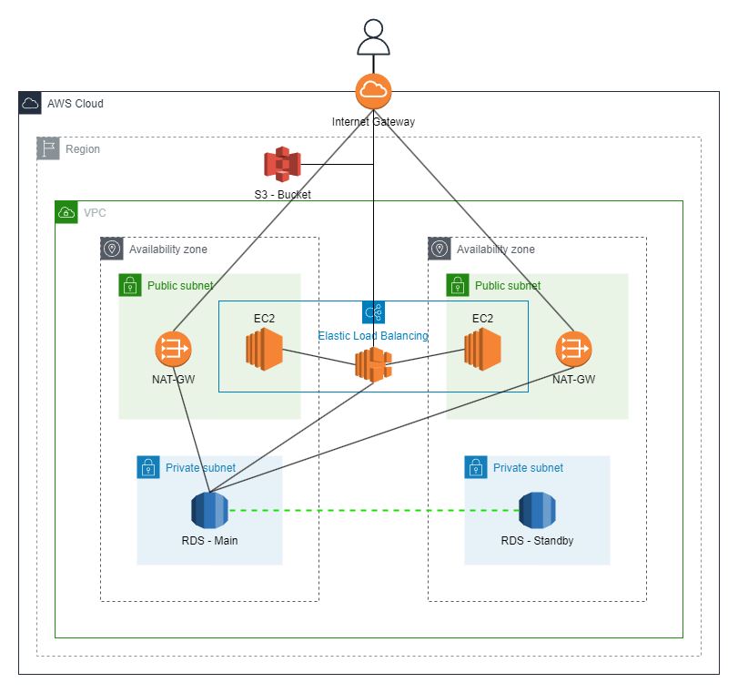

# Friday Challenge:

## Business Case:
## Scalable and Highly Available WordPress Hosting for a Company with Unpredictable Workloads

### Executive Summary:
The company in question runs a WordPress site that experiences highly unpredictable workloads. It is crucial for the company's online presence, reputation, and data security to maintain website availability, optimal performance, and robust security during peak traffic periods. Implementing a secure, scalable, and highly available infrastructure on AWS will ensure that the website remains accessible, responsive, and protected against threats, even during unexpected spikes in traffic.

### Problem Statement:
The company's current infrastructure is not designed to handle the unpredictability of its workloads, nor does it provide adequate security measures. This limitation can result in slow page load times, poor user experience, potential downtime, and increased vulnerability to security breaches during periods of high traffic. These issues can lead to lost revenue, decreased customer satisfaction, and damage to the company's reputation.

### Proposed Solution:
We propose implementing a secure, highly available, and scalable infrastructure on AWS using services such as EC2, RDS, S3, and other AWS components. This solution will involve:

1. Distributing web servers across multiple Availability Zones (AZs) to ensure high availability and redundancy.
2. Employing an Auto Scaling group to automatically scale the number of web servers based on traffic demand.
3. Implementing a load balancer to distribute incoming traffic evenly across web servers.
4. Utilizing a Multi-AZ RDS deployment for the database, with a master and standby instance in different AZs, ensuring high availability and automatic failover.
5. Creating read replicas to scale database read capacity during periods of high traffic.
6. Storing media files on an S3 bucket for better performance and cost-efficiency.
7. Implementing security enhancements, such as network segregation, security groups, NACLs, IAM roles and policies, data encryption, and monitoring and logging.

### Benefits:
1. High Availability: By distributing resources across multiple AZs and implementing automatic failover, the proposed solution ensures that the website remains operational even in the event of component failures or data center outages.
2. Scalability: The Auto Scaling group and read replicas allow the infrastructure to scale up or down in response to changing traffic patterns, ensuring optimal performance during both high and low traffic periods.
3. Cost Efficiency: By scaling resources according to demand, the company pays only for the resources it needs at any given time, reducing operational costs.
4. Enhanced Reputation: By maintaining a fast and reliable website, the company can establish itself as a trustworthy and dependable online presence.
5. Enhanced Reputation: By maintaining a fast and reliable website, the company can establish itself as a trustworthy and dependable online presence.
6. Robust Security: Implementing comprehensive security measures helps protect sensitive data, maintain compliance with industry standards and regulations, and mitigate the risk of security breaches.

### Conclusion:
Investing in a secure, highly available, and scalable infrastructure on AWS will ensure that the company's WordPress site remains accessible, responsive, and protected during periods of unpredictable traffic. This investment will improve user experience, reduce operational costs, protect sensitive data, and preserve the company's reputation, ultimately leading to increased customer satisfaction and business growth.